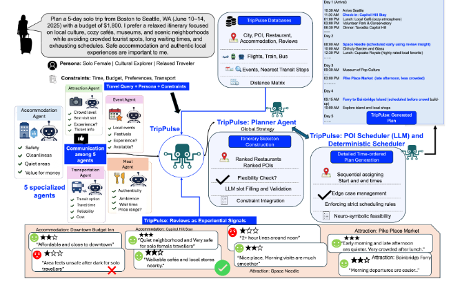

<div align="center">

<h1 align="center">🌍 TripPulse: Multi-Agent Travel Planning with Review-Grounded Reasoning ✈️</h1>

[](PAPER_URL)
[](ARXIV_URL)

<p align="center">
     <br>
</p>

This is the official implementation of **TripPulse**, a neuro-symbolic multi-agent framework for personalized, spatio-temporal travel planning with review-grounded reasoning.

</div>

## 📢 News

* 2026/XX/XX: 🎉 **TripPulse** has been accepted to **EMNLP 2026 (Findings)**.
* 2026/XX/XX: 🚀 Code and resources for TripPulse are being released.

# 🧭 TripPulse Overview

We introduce **TripPulse**, a multi-agent framework for personalized travel planning that combines **LLM-based semantic reasoning** with **deterministic constraint enforcement**.

Unlike conventional monolithic travel planners, TripPulse decomposes itinerary generation into specialized agents responsible for different travel domains, including **accommodations, transportation, restaurants, attractions, and events**. A central **Global Orchestrator** coordinates these agents and constructs a globally consistent travel plan.

To capture experiential information that is not available in structured travel databases, we additionally augment the TripCraft benchmark with structured **Pros** and **Cons** extracted from real-world user reviews.

The resulting framework combines:

* 🤖 **Multi-agent decomposition** for domain-specific reasoning
* ⭐ **Review-grounded reasoning** using extracted Pros and Cons
* 🧠 **Persona-aware entity selection and ranking**
* ⏱️ **Deterministic spatio-temporal scheduling**
* 💰 **Budget-aware itinerary construction**
* 📊 **Review-Grounded Persona Alignment (RGPA)** for experiential evaluation

TripPulse therefore separates the two types of reasoning required for travel planning: **LLMs handle semantic and preference-driven decisions, while deterministic algorithms enforce rigid temporal and mathematical constraints.**

# 🏗️ Architecture

TripPulse consists of specialized domain agents coordinated by a Global Orchestrator.

The domain agents independently reason over localized travel information and produce candidate entities and rankings. The Global Orchestrator then coordinates these outputs while maintaining global constraints such as budget and itinerary structure.

The final itinerary can be generated using either:

1. **LLM Scheduler** — uses an LLM to construct the detailed itinerary.
2. **Deterministic Algorithmic Scheduler** — programmatically constructs the itinerary while strictly enforcing temporal constraints.

This hybrid design allows TripPulse to preserve the semantic flexibility of LLMs while avoiding the temporal and mathematical errors commonly observed during generative scheduling.

# ⭐ Review-Grounded Reasoning

TripPulse augments the original TripCraft data with qualitative information extracted from user reviews.

We process reviews associated with:

* 🏨 Accommodations
* 🍽️ Restaurants
* 🏛️ Attractions

The extracted information is represented as structured:

```text
Pros
Cons
```

These review-derived signals are provided to the corresponding domain agents and used during entity selection and ranking.

The augmented dataset contains:

| Domain         | Entities | Reviews / Entity |
| -------------- | -------: | ---------------: |
| Accommodations |    2,369 |             7.65 |
| Restaurants    |    3,791 |            11.22 |
| Attractions    |    4,897 |            10.41 |

The review augmentation allows TripPulse to reason about qualitative preferences such as atmosphere, service quality, uniqueness, and potential negative experiences that are difficult to represent using structured databases alone.

# 📊 Review Extraction Quality

We evaluate the quality of the extracted Pros and Cons using Qwen3-32B.

| Metric          | Accommodation | Restaurant | Attraction |
| --------------- | ------------: | ---------: | ---------: |
| Precision (Pro) |         98.00 |      96.40 |      99.57 |
| Precision (Con) |         75.60 |      73.10 |      96.07 |
| Sentiment (Pro) |        100.00 |     100.00 |      99.57 |
| Sentiment (Con) |         91.30 |      97.80 |      96.07 |

These results indicate that the extracted review signals are highly reliable, particularly for positive experiential attributes.

# 🔬 Benchmark

TripPulse is evaluated on the **TripCraft** benchmark, augmented with structured review-derived Pros and Cons.

We evaluate three planning horizons:

```text
3-day
5-day
7-day
```

The benchmark provides structured travel queries containing destination sequences, trip duration, budget, traveler persona, transportation information, and hard planning constraints.

# 🤖 Supported Models

We evaluate TripPulse across multiple model families and capability levels:

* **GPT-5**
* **Llama-3.1-70B-Instruct**
* **DeepSeek-R1-Distill-Qwen-14B**
* **Phi-4**
* **Mistral-Nemo-Instruct-2407**
* **Qwen-2.5-7B-Instruct**

All models are evaluated in a **zero-shot setting without task-specific fine-tuning**.

## 🔓 Augmented Dataset Access

TripPulse uses an **augmented version of the TripCraft benchmark**, extended with review-derived qualitative information for accommodations, restaurants, and attractions.

The augmented dataset contains structured **Pros** and **Cons** extracted from real-world user reviews and is used by the TripPulse agents for review-grounded entity selection and ranking.

The dataset includes:

| Domain            | Entities | Reviews / Entity | Pros / Entity | Cons / Entity |
| ----------------- | -------: | ---------------: | ------------: | ------------: |
| 🏨 Accommodations |    2,369 |             7.65 |          5.09 |          2.00 |
| 🍽️ Restaurants   |    3,791 |            11.22 |          4.98 |          4.16 |
| 🏛️ Attractions   |    4,897 |            10.41 |          9.47 |          7.11 |

### 📥 Download

The **TripPulse augmented dataset** is available at the following Google Drive link:

👉 **[Download the TripPulse Augmented Dataset](GOOGLE_DRIVE_LINK)**

After downloading, extract the dataset into the following directory:

```text
TripPulse/
├── data/
│   └── <augmented_dataset>
├── agents/
├── evaluation/
├── postprocess/
└── run.sh
```

> **Note:** The augmented dataset is derived from the TripCraft benchmark and additionally contains review-grounded **Pros** and **Cons** for travel entities. Please refer to the paper for details on the review collection, processing, and extraction pipeline.


# 🐍 Setup Environment

Ensure that Miniconda or Anaconda is installed.

Check the installation:

```bash
conda --version
```

Create the TripPulse environment:

```bash
conda env create -f <ENVIRONMENT_FILE>.yml -n trippulse
conda activate trippulse
```

Install any additional dependencies specified by the repository:

```bash
pip install -r requirements.txt
```

> Replace the environment and dependency commands above with the exact files provided in this repository.

# 🔑 Configuration

Before running TripPulse, configure the required model/API settings and paths to the TripCraft database and augmented review data.

For example:

```bash
# Configure model
MODEL=<MODEL_NAME>

# Configure data paths
DATA_DIR=<PATH_TO_DATA>

# Configure output directory
OUTPUT_DIR=<PATH_TO_OUTPUT>
```

Please refer to the configuration files in this repository for the complete set of parameters.

# 🚀 Running TripPulse
## 🚀 Running

TripPulse supports two experimental settings:

1. **Without Review Information** — generates itineraries using the standard TripCraft database.
2. **With Review Pros and Cons** — generates review-grounded itineraries using the augmented TripCraft dataset containing extracted Pros and Cons.

Before running either setting, ensure that the required database and augmented review data are downloaded and placed in the appropriate directories.

### 1️⃣ Without Review Information

For standard agentic travel planning without review-derived information, use:

```bash
python run.py
```

The script internally calls:

```text
tools/planner/agentic_planning.py
```

The main configuration can be modified directly in `run.py`:

```python
MODEL_NAME = "mistral"
DAY_TYPES = [3, 5, 7]

OUTPUT_DIR = "output_agentic_final"
BASEPATH = "./TripCraft_database"
API_KEY = "your_api_key_here"
```

#### Supported Models

```text
qwen2.5
phi4
mistral
llama
deepseek
```

#### Trip Duration

```python
DAY_TYPES = [3, 5, 7]
```

corresponding to:

* `3` — 3-day itinerary
* `5` — 5-day itinerary
* `7` — 7-day itinerary

To run a specific configuration, modify `MODEL_NAME` and `DAY_TYPES` in `run.py`.

The script automatically waits until sufficient GPU memory is available before starting the experiment.

---

### 2️⃣ With Review Pros & Cons

For review-grounded travel planning, use:

```bash
python run_review.py
```

The script internally calls:

```text
tools/planner/agentic_planning_with_pro_cons.py
```

This configuration uses the **TripPulse augmented dataset**, which contains review-derived **Pros** and **Cons** for accommodations, restaurants, and attractions.

The main configuration can be modified directly in `run_review.py`:

```python
MODEL_NAMES = [
    "qwen2.5",
    "phi4",
    "mistral",
    "llama",
    "deepseek"
]

DAY_TYPES = [3,5,7]

OUTPUT_DIR = "output_agentic_review_pro_cons_final"
BASEPATH = "./TripCraft_database"
API_KEY = "your_api_key_here"
```

#### Supported Models

The review-grounded pipeline currently supports:

```text
qwen2.5
phi4
mistral
llama
deepseek
```

Additional models can be added by modifying `MODEL_NAMES`.

#### Trip Duration

Modify:

```python
DAY_TYPES = [3, 5, 7]
```

to run the desired planning horizons.

For example:

```python
DAY_TYPES = [3, 5, 7]
```

runs experiments for 3-day, 5-day, and 7-day itineraries.

The script automatically runs each selected model for each selected trip duration.

---

### ⚙️ GPU Memory Check

Both `run.py` and `run_review.py` automatically monitor GPU memory using `nvidia-smi`.

The scripts wait until the required amount of free GPU memory is available and then launch the experiments.

The memory threshold and checking interval can be modified in the respective runner files:

```python
REQUIRED_FREE = 31000
CHECK_INTERVAL = 30
```

for the standard pipeline, and:

```python
REQUIRED_FREE = 40000
CHECK_INTERVAL = 30
```

for the review-grounded pipeline.

> **Note:** GPU memory requirements may vary depending on the selected model.

---

### 📂 Output Directories

The generated itineraries are saved to the configured output directories.

**Without reviews:**

```text
output_agentic_final/
```

**With review Pros & Cons:**

```text
output_agentic_review_pro_cons_final/
```

These generated outputs can then be passed to the postprocessing and evaluation scripts.


TripPulse supports multiple LLM backends and two scheduling pathways.

## Multi-Agent Planning

Run the complete planning pipeline using:

```bash
bash run.sh
```

The pipeline performs:

```text
User Query
    ↓
Global Orchestrator
    ↓
Domain-Specific Agents
    ├── Accommodation Agent
    ├── Transportation Agent
    ├── Restaurant Agent
    ├── Attraction Agent
    └── Event Agent
    ↓
Global Coordination
    ↓
Scheduling
    ↓
Final Itinerary
```

Please refer to the configuration/run scripts for model-specific settings.

# ⏱️ Scheduling

TripPulse provides two scheduling backends.

## 🧠 LLM Scheduler

The LLM scheduler uses an LLM to assign explicit start and end times to activities while considering:

* Activity ordering
* Transit buffers
* Meal timing
* Daily attraction limits
* Persona-aware activity durations
* Global itinerary constraints

Run the LLM scheduler using the corresponding configuration in the repository.

## ⚙️ Deterministic Algorithmic Scheduler

The deterministic scheduler replaces generative scheduling with programmatic execution.

It first constructs a day-level schedule skeleton containing fixed components such as:

* Accommodation
* Transportation
* Time-bound events

It then greedily populates remaining slots using the ranked restaurant and attraction candidates.

During insertion, the scheduler enforces:

* Mandatory transit buffers
* Meal timing constraints
* Activity duration constraints
* Persona-aware duration scaling
* Temporal ordering

This backend is designed to guarantee constraint satisfaction during final schedule construction.

# 🔄 Postprocessing

After the itinerary generation stage is complete, the generated outputs must be converted into the JSONL format required by the TripCraft evaluation pipeline.

Run the postprocessing script using the corresponding model and trip duration:

```bash
python jsonl.py --model <model_name> --day <3/5/7>
```

# ⚡ Evaluation

After postprocessing, the generated JSONL files are evaluated using two types of metrics:

1. **Constraint Metrics**
2. **Qualitative Metrics**

## 📌 Constraint Metrics

Constraint metrics evaluate whether the generated itineraries satisfy the structural, temporal, spatial, and hard constraints defined by the TripCraft benchmark.

The evaluation reports:

* **Delivery Rate (Del)**
* **Commonsense Pass Rate — Micro (CPRμ)**
* **Hard Constraint Pass Rate — Micro (HCPRμ)**
* **Final Pass Rate (FPR)**
* **Temporal Meal Score (Tm)**
* **Temporal Attraction Score (Ta)**
* **Normalized Temporal Attraction Score (T̃a)**
* **Spatial Score (Ss)**
* **Persona Alignment Score (Sp)**
* **Ordering Score (So)**

Run the constraint evaluation from the `evaluation` directory:

```bash
cd evaluation

Then run:

python eval.py \
    --set_type <3d/5d/7d> \
    --evaluation_file_path <path to file>

For example:

python eval.py \
    --set_type 3d \
    --evaluation_file_path <path_to_generated_jsonl>

The --set_type argument specifies the trip duration:

3d  → 3-day itinerary
5d  → 5-day itinerary
7d  → 7-day itinerary
📐 Qualitative Metrics

Qualitative evaluation measures the quality of the generated itinerary against the corresponding golden plan.

Run:

python qualitative_metrics.py \
    --anno_file <golden plan file path> \
    --gen_file <path to our file>

For example:

python qualitative_metrics.py \
    --anno_file <path_to_golden_plan> \
    --gen_file <path_to_generated_jsonl>

The --anno_file argument specifies the golden/reference plan, while --gen_file specifies the generated itinerary file.

## ⭐ Review-Grounded Persona Alignment (RGPA)

TripPulse introduces **Review-Grounded Persona Alignment (RGPA)** to evaluate experiential travel quality beyond traditional constraint metrics.

RGPA uses an **LLM-as-a-Judge** setup to compare itineraries generated with and without review-derived information.

The evaluator considers:

* **Persona Alignment**
* **Experiential Quality**
* **Overall Travel Satisfaction**

The evaluation produces both dimension-level scores and a pairwise **Win Rate**, representing the percentage of comparisons where the review-grounded itinerary is preferred.

Run RGPA evaluation using:

```bash
python <RGPA_EVALUATION_SCRIPT>.py \
    --review_output <REVIEW_OUTPUT> \
    --baseline_output <BASELINE_OUTPUT>
```

> Replace the command above with the exact evaluation script included in this repository.

# 📈 Main Results

TripPulse substantially improves constraint satisfaction compared with monolithic prompting and the previous agentic baseline.

In particular, the deterministic scheduler demonstrates strong improvements in strict constraint satisfaction across different model sizes.

For example, with GPT-5:

| Trip Duration |  CPRμ | HCPRμ |       FPR |
| ------------- | ----: | ----: | --------: |
| 3-day         | 98.92 | 90.90 | **74.42** |
| 5-day         | 98.61 | 88.06 | **62.04** |
| 7-day         | 98.80 | 88.34 | **68.67** |

The results demonstrate that deterministic scheduling is substantially more reliable than asking an LLM to perform dense spatio-temporal scheduling directly.

# 🧪 Review Integration Results

Review-grounded itineraries consistently receive higher preference under our RGPA evaluation.

For GPT-5, the review-grounded itinerary achieves:

| Trip Duration |   Win Rate |
| ------------- | ---------: |
| 3-day         | **80.52%** |
| 5-day         | **69.75%** |
| 7-day         | **79.82%** |

An independent evaluation using Qwen3-32B produces Win Rates of:

| Trip Duration |   Win Rate |
| ------------- | ---------: |
| 3-day         | **81.00%** |
| 5-day         | **65.49%** |
| 7-day         | **66.60%** |

We additionally conducted human evaluation on 40 itinerary pairs. Review-grounded itineraries were judged equal to or better than the baseline in **31/40 cases (77.5%)**.

# 🔍 Why Deterministic Scheduling?

Our experiments reveal several recurring failure modes when LLMs are directly responsible for exact itinerary scheduling:

### Duration hallucinations

LLMs may generate activities with zero duration, for example:

```text
10:42 → 10:42
```

### Chronological inconsistencies

An LLM may schedule a daytime meal at an invalid time such as:

```text
03:30 AM → 04:30 AM
```

### Transit violations

Generated schedules may place consecutive activities too close together while ignoring required transit buffers.

The deterministic scheduler eliminates these errors by calculating and validating the schedule programmatically.

This motivates the central design principle of TripPulse:

```text
LLM
 ↓
Semantic Selection & Ranking
 ↓
Deterministic Scheduler
 ↓
Constraint-Valid Itinerary
```

# 📚 Citation

If you use TripPulse in your research, please cite:

```bibtex
@inproceedings{<TRIPPULSE_CITATION_KEY>,
  title={TripPulse: Multi-Agent Travel Planning with Review-Grounded Reasoning},
  author={<AUTHORS>},
  booktitle={Proceedings of the 2026 Conference on Empirical Methods in Natural Language Processing},
  year={2026}
}
```

Please replace the placeholder citation information above with the final camera-ready BibTeX entry.

# 🙏 Acknowledgements

This project builds upon the **TripCraft** benchmark and its associated evaluation framework.

We sincerely thank the authors and contributors of TripCraft for making their benchmark and evaluation framework available to the research community.

We also acknowledge the contributors who supported the development, annotation, validation, and evaluation of this project.

# 📄 License

Please refer to the `LICENSE` file for the licensing terms of this repository.

# 👫 Contact

For questions, issues, or suggestions, please open an issue in this repository.
